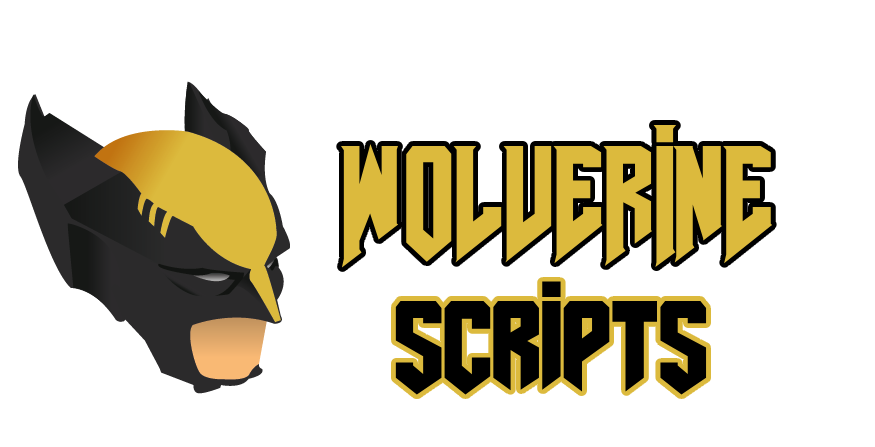

Within the digital realm, unseen hands explore, seeking ways to unlock possibilities untold.

# How to use
Just clone the repository in the folder you want, then lauch the script you want to use. 

# WolverineScripts

WolverineScripts is a bunch of little scripts to simplify your life while hacking ! It makes it way faster and easier (not needed to learn every commands...)

# Tools in the Framework

  - ettercap-graphical → Man in the Middle tool
  - hping3 → DoS/DDoS tool
  - Hydra → Multi purpose Bruteforce tool
 
# That's it !

Have fun with this little script, if you want to contact me, you can on Discord, Twitch or Twitter :

- Discord : lecoqhardi
- Twitter : @LeCoqHardi__
- Twitch : https://www.twitch.tv/LeCoqHardi

# Important Notes

- Made to work on Kali Linux but should work in any Linux Distros
- I can't be harmed if you do shit with these scripts, it's your own problem, I'm just providing them for learning purpose.
